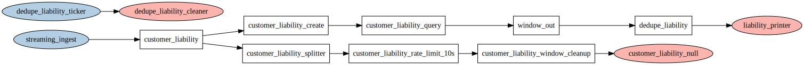

# Tributary

Attempts of a simple **event stream processor** using Go and Lua. Tributary allows to create
networks and define events that propagate through connected nodes. Network nodes process events
and can engage external resources, can decrease or multiply inputs from their in to their out
ports. Tributary networks are created and linked up by a lua runtime that allows custom node
manipulators to be exposed through the `tributary` module.

- flow based, isolates concurrently running network nodes
- network nodes send events through Go channels through their in and out ports
- networks can be created dynamically at run-time with a lua based vm

Possibility of simple **sliding windows** and event aggregate and join queries using external SQL Databases
- examples for windowing and query pipelines using Gorm. Tested with sqlite/mysql
  - sliding windows with time or count based query conditions
- rate limit or filter outputs for duplicates

Example **use cases**
- ingest customer actions from distributed systems that communicate event driven over a message bus
- pipe aggregate customer actions back onto a message bus based on query criteria
- send alerts to slack/telegram, http callbacks
- start workflows based on aggregated customer actions

## Concepts


As per [example/scripted](example/scripted/network.lua), we can set up such network at runtime
with lua scripts, e.g. here, showing a a ticker source, a debug printer, and node connections via
direct **link**, via **fan-out** and **fan-in**.

```lua
local tb = require('tributary')

tb.create_tester("tick_printer", ".")
tb.create_ticker("ticker_500ms", "500ms")
tb.create_ratelimit("filter_2s", "2s")
tb.create_forwarder("forwarder1")
tb.create_forwarder("forwarder2")

tb.link("ticker_500ms", "forwarder1")
tb.fanout("forwarder1", "filter_2s", "forwarder2")
tb.fanin("tick_printer", "filter_2s", "forwarder2")
```

Create a network that module will operate on, load the module into the runtime, then execute the
above script. The script will link up and control network nodes. When executed without error, run
the network nodes.

```go
n := network.New() // ... add custom nodes
m := module.New(n) // ... add custom exports to be available in the runtime
r := runtime.New()
r.LoadModule(m.Loader) // register the tributary module with the runtime
// Run will preload the tributary module and execute a script on the VM. We can close it
// after we called Run() to stop the execution.
if err := r.Run("./network.lua"); err != nil {
	log.Fatal(err)
}
defer r.Close()

// after nodes are linked up and the script is loaded without errors, run the network
n.Run()
```

We can print the network to a Graphviz output shown above with

```go
fmt.Println(tributary.Graphviz(n)
```

### Custom Nodes and Module Exports

Custom network nodes can be added by either implementing the **Source**, **Pipeline** or **Sink**
interfaces, or by utilizing provided abstractions for **Injectors**, **Interceptors** and
**Handlers** function types. A handler example would be a simple print function, e.g. we can
route messages to a `printer` node that is added as follows

```go
out := func(e tributary.Event) {
	fmt.Println(string(e.Payload()))
}
n := network.New()
n.AddNode("printer", handler.New(out))
```

Equally, we can add additional exports on the tributary lua module:

```go
myCustomFn := func(l *lua.LState) int {
	firstStringArg := l.CheckString(1)
	secondIntegerArg := l.CheckInt(2)
	// ... do sth with string arg 1 and integer arg 2
	// add boolean return value
	l.Push(module.LuaConvertValue(l, true))
	return 1
}
m := module.New(n)
m.Export("my_custom_fn", myCustomFn)
```

In the networking script we can now call `my_custom_fn` on the required module:

```lua
local tb = require('tributary')
tb.my_custom_fn("arg1", 2)
-- ...
```

### Available module functions

The following lua script prints all available functions, exported from the `tributary` module.

```lua
local tb = require("tributary")

print("functions:")
for i,v in pairs(tb) do
    if type(v) == "function" then
        print(i)
    end
end
```

The output is

```
functions:
sliding_window_time
create_filter
node_exists
fanin
create_ratelimit
create_tester
create_window
query_window
link
fanout
create_ticker
create_forwarder
create_discarder
```

### Sliding Window CEP



Create a windower on top of a mysql database and Gorm. With mysql we can span sliding windows
with time ranges and limits if desired on an incrementally built dataset.

```go
db := mysql.Open("root:root@tcp(localhost:3306)/tb")
gormCfg := &gorm.Config{
	SkipDefaultTransaction: true,
	PrepareStmt:            true,
	NamingStrategy: schema.NamingStrategy{
		TablePrefix: "example_",
	},
}
window, err := gormwindow.New(db, gormCfg, standardevent.New,
	&event.Bet{},
	&event.Selection{})
if err != nil {
	log.Fatal(err)
}
```

Add lua module exports for the windower with a struct, annotated for gorm tables

```go
m := module.New(n)
m.AddWindowExports(window, &event.Bet{})
```

We can then create and query a window on the runtime and link it up. The following creates a time
based sliding window `customer_liability` from a streaming ingest of type `event.Bet`, that joins
to `[]event.Selection`, fowards the queried data stream to `window_out` and the output ultimately
to a printer.

```lua
local tb = require("tributary")

-- select aggregate customer liability if > 130
local query = [[
select
	round(sum(stake*exchange_rate*(b.odds -1)), 2) as liability,
	customer_uuid,
	game_id
from
	example_bets b
join example_selections s on
	b.uuid = s.bet_uuid
where
	FROM_UNIXTIME(b.create_time) >= now() - interval 10 second
group by
	customer_uuid,
	game_id
having
	liability > 130
]]
-- input port, output port, query, table for cleanup, time too cleanup, unix timestamp in table
tb.sliding_window_time("customer_liability", "window_out", query, "example_bets", "10s", "create_time")

tb.create_filter("dedupe_liability", "10s")

-- setup network
tb.link("streaming_ingest", "customer_liability")
tb.link("window_out", "dedupe_liability")
tb.link("dedupe_liability", "liability_printer")
```

This will produce an output like

```plain
{"customer_uuid":"76d17c9e-734b-452c-a5ee-852d1e6261bd","game_id":123456,"liability":"138.00"}
{"customer_uuid":"76d17c9e-734b-452c-a5ee-852d1e6261bd","game_id":123456,"liability":"161.00"}
{"customer_uuid":"76d17c9e-734b-452c-a5ee-852d1e6261bd","game_id":654321,"stake":"100.00"}
...
```

This example can be found under [example/advanced](example/advanced), and run with

```
cd examples/advanced && make
```

## Todos & Notes

- graceful network node shutdown
- network with NATS/Rabbitmq etc
- network stats?
- telegram/slack/callback sink
- pubsub/rabbitmq source
- client
	- manage runtime networks in db
	- build graph, multi instance, pick up each script once, select dependencies
