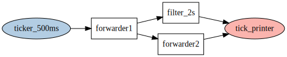

# Tributary

Simple **event stream processor** written in Go and Lua. Tributary allows to create networks and
define events that propagate through connected nodes. Network nodes process events and can engage
external resources, can decrease or multiply inputs from their in to their out ports. Tributary
networks are created and managed by a lua runtime that exposes networking primitives and allows
for custom node manipulators that can be registered through the `tributary` module.

- flow based, isolates concurrently running network nodes
- network nodes send events through Go channels through their in and out ports
- networks can be created dynamically with a lua based runtime

Possibility of simple **sliding windows** and event aggregate and join queries using SQL Databases
- includes examples for windowing and query pipelines using Gorm. Working with sqlite/mysql
  - implement sliding windows with time or limit based query conditions
- clear window after alert successfully sent from next network node
- filter outputs to avoid duplicates

Example **use cases**
- ingest customer actions from distributed systems that communicate event driven over a message bus
- pipe aggregate customer actions back onto a message bus based on query criteria
- send alerts to slack/telegram, http callbacks
- start workflows based on aggregate customer actions

## Examples

### Concepts



As per [example/scripted](example/scripted/network.lua), we can set up such network at runtime
with lua scripts, e.g. here, showing a a ticker source, a debug printer, and node connections via
direct **link**, via **fan-out** and **fan-in**.

```lua
local tb = require('tributary')

tb.create_tester("tick_printer", ".")
tb.create_ticker("ticker_500ms", "500ms")
tb.create_ratelimit("filter_2s", "2s")
tb.create_forwarder("forwarder1")
tb.create_forwarder("forwarder2")

tb.link("ticker_500ms", "forwarder1")
tb.fanout("forwarder1", "filter_2s", "forwarder2")
tb.fanin("tick_printer", "filter_2s", "forwarder2")
```

Create a network that module will operate on, load the module into the runtime, then execute the
above script. The script will link up and control network nodes. When executed without error, run
the network nodes.

```go
n := network.New() // ... add custom nodes
m := module.New(n) // ... add custom exports to be available in the runtime
r := runtime.New()
r.LoadModule(m.Loader) // register the tributary module with the runtime
// Run will preload the tributary module and execute a script on the VM. We can close it
// after we called Run() to stop the execution.
if err := r.Run("./network.lua"); err != nil {
	log.Fatal(err)
}
defer r.Close()

// after nodes are linked up and the script is loaded without errors, run the network
n.Run()
```

We can print the network to a Graphviz output shown above with

```go
fmt.Println(tributary.Graphviz(n)
```

### Custom Nodes and Module Exports

Custom network nodes can be added by either implementing the **Source**, **Pipeline** or **Sink**
interfaces, or by utilizing provided abstractions for **Injectors**, **Interceptors** and
**Handlers** function types. A handler example would be a simple print function, e.g. we can
route messages to a `printer` node that is added as follows

```go
out := func(e tributary.Event) {
	fmt.Println(string(e.Payload()))
}
n := network.New()
n.AddNode("printer", handler.New(out))
```

Equally, we can add additional exports on the tributary lua module:

```go
myCustomFn := func(l *lua.LState) int {
	firstStringArg := l.CheckString(1)
	secondIntegerArg := l.CheckInt(2)
	// do sth with arg 1 and 2
	// add return value
	l.Push(module.LuaConvertValue(l, true))
	return 1
}
m := module.New(n)
m.Export("my_custom_fn", myCustomFn)
```

In the networking script we can now call `my_custom_fn` on the required module:

```lua
local tb = require('tributary')
tb.my_custom_fn("arg1", 2)
-- ...
```

### Sliding Window CEP

TODO

### Todos & Notes

- `[]byte` json/octet-stream payloads
- filter reported or clear, uniqueness
- converge window create, query, filter cleanup, add window cleanup
- direct matcher, filter on attribute list, flat queries on one messages, `map[string]interface{}`. attribute ><>
- arbitrary event types?
- network could be created with NATS/Rabbitmq etc
- network stats
- graceful node shutdown
- telegram/slack/callback sink
- pubsub/rabbitmq source
- client Distributary?
	- manage lua scripts in db
	- build graph, multi instance, pick up each script once, select dependencies on graph
